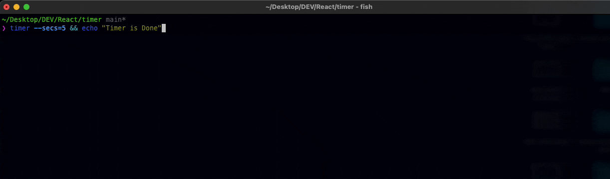

# timer

> This readme is automatically generated by [create-ink-app](https://github.com/vadimdemedes/create-ink-app)

## Install

```bash
$ npm install --global timer
```

## CLI

```
$ timer --help

  Options
    --secs=<number of seconds>

  Examples
    $ timer --name=5
   Hello, Jane
    ╓───────────────────────────────╖
    ║     Timer for 00h:00m:05s     ║
    ║     Remaining 00h:00m:05s     ║
    ╙───────────────────────────────╜
```

